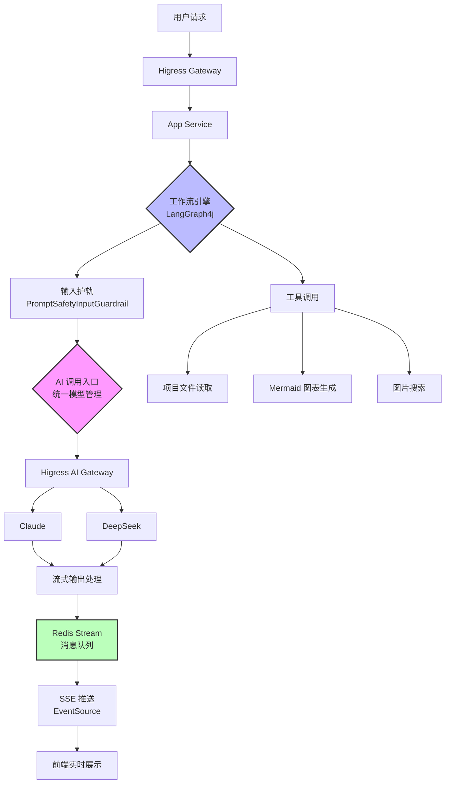

# Dango Code AI

> 基于 Spring Boot 3 + LangChain4j + LangGraph4j 的 AI 零代码应用生成平台。用户输入自然语言描述，由 AI Agent 通过工作流自动执行并发素材搜集、代码生成、质量检查与自动修复、项目构建的完整流程，支持多轮对话持续优化，最终一键部署为可访问的 Web 应用。项目采用 Spring Cloud Alibaba + Dubbo 微服务架构，通过分布式限流、Redis 缓存、Prompt 护轨等策略保障系统稳定性与安全性。

**在线体验**: [dango1123.online](http://dango1123.online)

---

## 演示截图

<!-- 占位符：待添加实际截图 -->


---

## 核心功能

1. 多模式代码生成

  - Vue 项目生成：完整的 Vue 3 + Vite 项目，包含 UI、逻辑、样式
  - 力扣题解生成：自动生成算法题的动画讲解页面
  - 面试题解生成：生成面试题的动画讲解和答案解析
  - 源码剧场生成：生成源码分析的三段式动画讲解

  2. 智能工作流引擎（基于 LangGraph4j）

  - 创建模式：图片收集（内容图/插画/架构图/Logo）→ 提示词增强 → 代码生成
  - 修改模式：代码读取 → 意图分类 → 修改规划 → 数据库操作 → 代码修改
  - 构建检查：自动检查构建错误 → 代码修复（最多 3 次重试）

  3. 实时流式对话

  - SSE 流式输出：AI 生成过程实时展示
  - 断点续传：刷新页面后自动恢复生成进度（Redis Stream 缓存）
  - 工具调用可视化：前端实时展示 AI 调用的工具（写文件、读文件、搜索图片等）

  4. 丰富的 AI 工具系统

  - 文件操作：写入、读取、修改、删除文件
  - 图片资源：Pexels 图片搜索、Undraw 插画、Logo 生成
  - 架构图生成：Mermaid 代码转 SVG 架构图
  - 目录结构读取：获取项目目录树

  5. 应用管理

  - 我的作品：创建、编辑、删除应用
  - 精选案例：展示优质应用（带缓存优化）
  - 在线部署：一键部署到云端，生成访问链接
  - 代码下载：导出完整项目代码

  6. 用户系统

  - 用户注册/登录
  - 个人设置
  - 管理员后台（用户管理、应用管理、对话管理）

---

## 技术栈

| 层级 | 技术选型 | 说明 |
|------|---------|------|
| **前端** | Vue 3 + TypeScript + Vite | 现代化前端框架，类型安全 |
| | Ant Design Vue + Pinia | UI 组件库 + 状态管理 |
| **后端** | Java 21 + Spring Boot 3.5 | 虚拟线程支持，性能提升 |
| | Spring Cloud + Dubbo 3.3 | 微服务治理 + RPC 通信 |
| | MyBatis-Flex | 轻量级 ORM，支持多数据源 |
| **AI 能力** | LangChain4j + LangGraph4j | AI 应用开发框架 + 工作流引擎 |
| | Higress AI Gateway | 多模型统一调度，支持负载均衡 |
| | Claude / DeepSeek | 主力代码生成模型 |
| **数据存储** | MySQL 8.0 | 主数据库 |
| | Redis 7 | 缓存 + 消息队列 + 分布式锁 |
| **服务治理** | Nacos 3.1 | 配置中心 + 服务注册 |
| | Higress | 云原生网关，支持 AI 插件 |
| **可观测性** | Prometheus + Grafana | 指标监控与可视化 |
| | 腾讯云 CLS | 日志采集与分析 |
| **安全与限流** | Sa-Token | 权限认证 |
| | Redisson | 分布式限流 + 分布式锁 |

---

## 系统架构

### 微服务拓扑

<!-- 占位符：使用 Excalidraw 手绘架构图 -->


**核心组件**：
- **Higress Gateway**: 统一入口，集成 AI 插件
- **User Service**: 用户认证与权限管理
- **App Service**: 核心业务逻辑（应用管理、工作流执行）
- **Screenshot Service**: 网页截图服务
- **Supabase Service**: Supabase 平台集成

### 工作流执行流程



**关键流程**：
1. 用户通过前端发起代码生成请求
2. Higress Gateway 路由到 App Service
3. LangGraph4j 工作流引擎解析执行流程
4. 输入护轨检查提示词安全性
5. 统一 AI 调用入口选择最优模型（Claude/DeepSeek）
6. Higress AI Gateway 负载均衡调度
7. 流式输出通过 Redis Stream 传递
8. SSE (Server-Sent Events) 实时推送到前端
9. 工具调用（文件读取、图表生成、图片搜索等）按需执行

**数据库初始化流程**（与 AI 工作流结合）：
1. 用户点击"初始化数据库"按钮
2. 后端调用 Supabase Service 创建独立 Schema（`app_{appId}`）
3. 自动配置权限并暴露 REST API
4. 生成前端 Supabase 客户端配置文件
5. **前端自动触发 AI 对话**："数据库已启用，请分析应用并创建合适的数据库表，然后更新代码使用数据库"
6. AI 通过工作流分析应用结构，生成建表 SQL
7. AI 自动更新代码，集成 Supabase 客户端

---

## 核心设计亮点

### 1. LangChain4j 框架核心能力
**设计理念**：基于 LangChain4j 框架构建 AI 应用，利用其声明式 API 和流式处理能力简化 AI 集成。

**核心能力**：
- **AiService 声明式接口**：通过注解定义 AI 服务，自动处理提示词模板和参数绑定
  
  ```java
  public interface CodeGeneratorService {
      @SystemMessage("你是一个专业的代码生成助手")
      @UserMessage("根据需求生成代码：{{requirement}}")
      String generateCode(@V("requirement") String requirement);
  }
  ```
- **TokenStream 流式输出**：支持实时流式响应，提升用户体验
  ```java
  TokenStream tokenStream = aiService.generateStream(prompt);
  tokenStream.onNext(token -> sendToClient(token))
             .onComplete(() -> log.info("生成完成"))
             .start();
  ```
- **ChatMemory 对话记忆**：基于 Redis 的分布式对话历史管理
  - 支持多轮对话上下文保持
  - 自动管理 Token 窗口大小
  - 支持按用户/会话隔离
- **Tool 工具调用**：统一的工具注册与调用机制
  - 自动解析工具参数和返回值
  - 支持工具链式调用
  - 内置错误处理和重试机制

**统一 AI 调用入口与成本优化**：

**设计理念**：将分散在各工作流节点、各业务服务中的 AI 模型调用统一管理，通过 `HigressAiModelProvider` 作为唯一入口，实现模型选择、配置管理、缓存复用的集中控制。

**核心价值**：
- **统一入口**：所有 AI 模型调用都通过 `HigressAiModelProvider` 获取
  - 避免各处直接创建 `OpenAiChatModel`，难以统一管理
  - 便于统一添加监控、日志、限流等横切关注点
  - 通过 Nacos 配置中心灵活调整模型能力（模型类型、超时、Token 数）
- **差异化模型选择**：11 种 AI 服务类型，根据任务复杂度选择模型
  - 复杂任务（代码生成、修改规划）→ `strong` 模型（Claude）
  - 简单任务（QA、意图分类）→ `weak` 模型（DeepSeek）
- **AiService 缓存**（AiCodeGeneratorServiceFactory）：每个应用独立 AiService 实例，缓存 30 分钟，避免重复反射解析注解和动态代理
- **Nacos 动态配置**：运行时修改模型配置，无需重启服务
  - 监听 `EnvironmentChangeEvent`，自动清空 Model 和 AiService 缓存
  - 支持调整模型、超时时间、最大 Token 数
- **对话历史预加载**：
  - AiService 创建时从数据库预加载历史对话（20 条）
  - 保证用户长时间离开后再回来，AI 仍能记住之前的对话上下文

**实现方案**：

```java
@Component
public class HigressAiModelProvider {
    private final ConcurrentHashMap<AiServiceType, ChatModel> chatModelCache = new ConcurrentHashMap<>();

    public ChatModel getChatModel(AiServiceType serviceType) {
        return chatModelCache.computeIfAbsent(serviceType, this::buildChatModel);
    }

    // 监听 Nacos 配置变更
    @EventListener(EnvironmentChangeEvent.class)
    public void onConfigChange(EnvironmentChangeEvent event) {
        if (event.getKeys().stream().anyMatch(key -> key.startsWith("ai."))) {
            log.info("检测到 AI 配置变更，清空模型缓存");
            chatModelCache.clear();
            streamingModelCache.clear();
        }
    }
}
```

**配置示例**（Nacos `shared-ai.yml`）：
```yaml
ai:
  default-model: weak  # 默认使用低成本模型

  services:
    code-generator:
      model: strong      # 代码生成用高性能模型
      max-tokens: 65536
      timeout: 300s
    qa:
      model: weak        # 问答用低成本模型
      timeout: 120s
```

### 2. LangGraph4j 工作流引擎
**设计理念**：将复杂的代码生成流程拆解为可复用的节点，支持条件分支、循环与并行执行。

**核心特性**：
- **状态管理**：基于 `StateGraph` 的有向图状态机
- **流式输出**：每个节点的输出通过 `MessagePort` 实时推送
- **工具集成**：统一的 `BaseTool` 接口，支持动态注册
- **错误恢复**：节点执行失败自动重试或降级

### 3. 虚拟线程 + SkyWalking 链路追踪
**设计理念**：利用 Java 21 虚拟线程提升并发性能，同时保证分布式链路追踪的完整性。

**实现方案**：
- `TracedVirtualThread`：包装虚拟线程，使用 SkyWalking Wrapper 传递 Span 上下文
- `ContextPropagatingTaskExecutor`：Spring 异步任务执行器，传播 MonitorContext 和 MDC
- 支持跨服务的链路追踪（通过 Dubbo Filter）

```java
// 虚拟线程 + SkyWalking 链路追踪
public class TracedVirtualThread {
    public static Thread start(Runnable task) {
        String traceId = TraceContext.traceId();
        // 使用 SkyWalking Wrapper 传递 Span 上下文
        Runnable skywalkingWrapped = RunnableWrapper.of(task);
        return Thread.startVirtualThread(wrapWithMdc(skywalkingWrapped, traceId));
    }
}
```

### 4. Redis Stream 消息缓存
**设计理念**：使用 Redis Stream 作为临时消息缓存，支持 SSE 断点续传。

**核心机制**：
- **消息追加**：AI 输出实时写入 Redis Stream
- **游标读取**：客户端通过 `lastEventId` 从指定位置读取
- **阻塞读取**：支持阻塞等待新消息（用于 SSE 长连接）
- **TTL 过期**：依赖 Redis Key 过期自动清理历史消息

**注**：当前实现为简化版本，未使用消费者组机制，适合单用户场景。

### 5. Supabase 多租户隔离
**设计理念**：为每个生成的应用自动创建独立的数据库 Schema，实现数据隔离与 REST API 自动暴露。

**核心机制**：
- **动态 Schema 创建**：每个应用对应一个 PostgreSQL Schema（`app_{appId}`）
- **权限自动配置**：自动授权 `anon` 角色访问 Schema 和表
- **REST API 暴露**：通过 PostgREST 自动生成 RESTful API
- **SQL 执行隔离**：通过 `search_path` 确保 SQL 在正确的 Schema 中执行

```java
// 创建应用专属 Schema
public SupabaseConfigDTO createSchema(Long appId) {
    String schemaName = "app_" + appId;

    // 1. 创建 Schema
    executeSql("CREATE SCHEMA IF NOT EXISTS " + schemaName);

    // 2. 授权 anon 角色
    executeSql("GRANT USAGE ON SCHEMA " + schemaName + " TO anon");

    // 3. 暴露到 REST API
    managementClient.exposeSchema(schemaName);

    return new SupabaseConfigDTO(url, anonKey, schemaName);
}
```

### 6. 分布式限流与缓存
**设计理念**：保护 AI 接口不被滥用，同时提升响应速度。

**实现方案**：
- **Redisson 限流**：`@RateLimit` 注解 + AOP，支持用户级/IP 级限流
- **Spring Cache + Redis**：缓存精选应用列表，减少数据库查询
- **Caffeine 本地缓存**：热点数据二级缓存，降低 Redis 压力

### 7. ID 游标分页
**设计理念**：避免深分页性能问题，支持无限滚动加载。

**实现方案**：
```sql
-- 基于 ID 游标的分页查询
SELECT * FROM applications
WHERE id > #{cursor}
ORDER BY id ASC
LIMIT #{pageSize}
```

**优势**：
- 性能稳定，不受数据量影响
- 支持实时数据插入
- 避免 OFFSET 深分页的性能陷阱

---

## 技术难点与解决方案

### 难点 1：AI 流式输出的实时性与断点续传
**挑战**：
- AI 模型响应时间不可控（1-30 秒）
- 网络抖动导致 SSE 连接断开
- 页面刷新后需要恢复历史消息

**解决方案**：
1. **Redis Stream 消息缓存**：AI 输出实时写入 Redis Stream
2. **SSE 断点续传**：客户端通过 `lastEventId` 从断点位置继续接收
3. **EventSource 自动重连**：浏览器原生支持 SSE 自动重连
4. **阻塞读取**：服务端支持阻塞等待新消息，减少轮询

### 难点 2：工作流节点的动态编排
**挑战**：
- 用户自定义工作流，节点类型不固定
- 节点间依赖关系复杂（条件分支、循环）
- 节点执行失败需要回滚或重试

**解决方案**：
1. **LangGraph4j 状态图**：基于有向图的状态机
2. **统一节点接口**：所有节点实现 `WorkflowNode` 接口
3. **状态快照**：每个节点执行后保存状态，支持回滚
4. **错误处理节点**：专门处理异常的节点类型

### 难点 3：多模型调度与成本优化
**挑战**：
- 不同模型的能力与成本差异大（Claude > DeepSeek）
- 高峰期模型限流
- 模型响应速度不稳定

**解决方案**：
1. **Higress AI Gateway**：统一模型调度，支持负载均衡
2. **智能降级**：Claude 限流时自动切换到 DeepSeek
3. **成本控制**：简单任务优先使用 DeepSeek

### 难点 4：分布式链路追踪的上下文传播
**挑战**：
- 虚拟线程切换时 ThreadLocal 失效
- 异步任务丢失 TraceId
- Dubbo RPC 调用链路断裂

**解决方案**：
1. **TracedVirtualThread + SkyWalking Wrapper**：包装虚拟线程，传递 Span 上下文
2. **ContextPropagatingTaskExecutor**：Spring 异步任务传播 MonitorContext 和 MDC
3. **Dubbo Filter**：RPC 调用时自动传递 TraceId
4. **统一拦截器**：HTTP 请求入口注入 TraceId

---

## 代码实现亮点

### 1. 统一工具管理机制
所有 AI 工具继承 `BaseTool`，通过 `ToolManager` 集中注册与调用：

```java
@Component
public class ToolManager {
    private final Map<String, BaseTool> tools = new HashMap<>();

    @PostConstruct
    public void registerTools() {
        tools.put("fileRead", new FileReadTool());
        tools.put("fileWrite", new FileWriteTool());
        tools.put("mermaidDiagram", new MermaidDiagramTool());
        tools.put("imageSearch", new ImageSearchTool());
    }

    public Object executeTool(String toolName, Map<String, Object> params) {
        BaseTool tool = tools.get(toolName);
        return tool.execute(params);
    }
}
```

### 2. 输入护轨（Prompt Safety）
基于关键词匹配与正则表达式的提示词安全检查：

```java
@Component
public class PromptSafetyInputGuardrail implements Guardrail {
    private static final List<String> BLOCKED_KEYWORDS = List.of(
        "ignore previous instructions",
        "system prompt",
        "jailbreak"
    );

    @Override
    public GuardrailResult validate(String input) {
        for (String keyword : BLOCKED_KEYWORDS) {
            if (input.toLowerCase().contains(keyword)) {
                return GuardrailResult.blocked("检测到不安全的提示词");
            }
        }
        return GuardrailResult.success();
    }
}
```

### 3. 分布式限流注解
基于 Redisson 的 AOP 限流实现：

```java
@Target(ElementType.METHOD)
@Retention(RetentionPolicy.RUNTIME)
public @interface RateLimit {
    int rate() default 10;           // 每秒请求数
    RateLimitType type() default RateLimitType.USER;  // 限流维度
}

@Aspect
@Component
public class RateLimitAspect {
    @Around("@annotation(rateLimit)")
    public Object around(ProceedingJoinPoint point, RateLimit rateLimit) {
        String key = buildKey(rateLimit.type());
        RRateLimiter limiter = redissonClient.getRateLimiter(key);
        limiter.trySetRate(RateType.OVERALL, rateLimit.rate(), 1, RateIntervalUnit.SECONDS);

        if (!limiter.tryAcquire()) {
            throw new RateLimitException("请求过于频繁");
        }
        return point.proceed();
    }
}
```

### 4. SSE 流式推送
```java
// 后端：SSE 端点
@GetMapping(value = "/chat/gen/resume", produces = MediaType.TEXT_EVENT_STREAM_VALUE)
public Flux<ServerSentEvent<String>> resumeGenStream(
        @RequestParam Long appId,
        @RequestParam(required = false, defaultValue = "0") String lastEventId) {

    // 从 Redis Stream 消费消息
    Flux<String> contentFlux = codeGenApplicationService.consumeGenerationStream(appId, loginUserId, lastEventId);

    return contentFlux
        .map(chunk -> ServerSentEvent.<String>builder().data(chunk).build())
        .concatWith(Mono.just(ServerSentEvent.<String>builder().event("done").data("").build()));
}
```

```javascript
// 前端：EventSource 客户端
const eventSource = new EventSource(
  `/api/app/chat/gen/resume?appId=${appId}`,
  { withCredentials: true }
)

eventSource.onmessage = (event) => {
  const data = JSON.parse(event.data)
  // 处理流式数据
  appendMessage(data.content)
}

eventSource.addEventListener('done', () => {
  eventSource.close()
})
```

### 5. Redis Stream 消息生产与消费
```java
// 生产者
public void sendMessage(String streamKey, Map<String, String> message) {
    stringRedisTemplate.opsForStream()
        .add(StreamRecords.newRecord()
            .ofStrings(message)
            .withStreamKey(streamKey));
}

// 消费者（从 Redis Stream 读取并通过 SSE 推送）
public Flux<String> consumeGenerationStream(Long appId, Long userId, String lastEventId) {
    String streamKey = "ai-output:" + appId + ":" + userId;

    return Flux.create(sink -> {
        // 从 lastEventId 开始读取（支持断点续传）
        List<MapRecord<String, Object, Object>> records = stringRedisTemplate.opsForStream()
            .read(StreamOffset.create(streamKey, ReadOffset.from(lastEventId)));

        records.forEach(record -> {
            String content = (String) record.getValue().get("content");
            sink.next(content);
        });

        sink.complete();
    });
}
```

### 6. 虚拟线程池配置
```java
@Configuration
public class VirtualThreadConfig {
    @Bean
    public TaskExecutor taskExecutor() {
        return new ContextPropagatingTaskExecutor(
            Executors.newVirtualThreadPerTaskExecutor()
        );
    }
}

// 使用虚拟线程执行异步任务
@Async
public CompletableFuture<String> generateCode(String prompt) {
    // 自动在虚拟线程中执行
    return CompletableFuture.completedFuture(aiService.generate(prompt));
}
```

### 7. Supabase 多租户数据库隔离
```java
// Supabase 服务实现
@Service
@DubboService
public class SupabaseServiceImpl implements SupabaseService {

    @Override
    public SupabaseConfigDTO createSchema(Long appId) {
        String schemaName = "app_" + appId;

        // 1. 创建独立 Schema
        String createSchemaSql = "CREATE SCHEMA IF NOT EXISTS " + schemaName;
        managementClient.executeSql(createSchemaSql);

        // 2. 授权 anon 角色访问
        String grantSql = String.format("""
            GRANT USAGE ON SCHEMA %s TO anon;
            GRANT ALL PRIVILEGES ON ALL TABLES IN SCHEMA %s TO anon;
            GRANT USAGE, SELECT ON ALL SEQUENCES IN SCHEMA %s TO anon;
            """, schemaName, schemaName, schemaName);
        managementClient.executeSql(grantSql);

        // 3. 暴露 Schema 到 REST API（通过 PostgREST）
        managementClient.exposeSchema(schemaName);

        return SupabaseConfigDTO.builder()
            .url(properties.getUrl())
            .anonKey(properties.getAnonKey())
            .schemaName(schemaName)
            .build();
    }

    @Override
    public String executeSql(Long appId, String sql) {
        String schemaName = "app_" + appId;
        // 设置 search_path，确保 SQL 在正确的 Schema 中执行
        String fullSql = String.format("SET search_path TO %s; %s", schemaName, sql);
        return managementClient.executeSql(fullSql);
    }
}
```

---

## 项目结构

```
CodeForge-AI/
├── frontend/                    # 前端项目（Vue 3 + TypeScript）
│   ├── src/
│   │   ├── api/                # API 接口封装
│   │   ├── components/         # 通用组件
│   │   ├── views/              # 页面组件
│   │   ├── stores/             # Pinia 状态管理
│   │   └── router/             # 路由配置
│   └── Dockerfile
│
├── backend/                     # 后端项目（Java 21 + Spring Boot 3.5）
│   ├── user/                   # 用户服务
│   │   ├── user-api/           # API 接口定义
│   │   ├── user-service/       # 服务实现
│   │   └── Dockerfile.user
│   │
│   ├── app/                    # 应用服务（核心业务）
│   │   ├── app-api/            # API 接口定义
│   │   ├── app-service/        # 服务实现
│   │   └── Dockerfile.app
│   │
│   ├── screenshot/             # 截图服务
│   │   ├── screenshot-api/
│   │   ├── screenshot-app/
│   │   └── Dockerfile.screenshot
│   │
│   ├── supabase/               # Supabase 集成服务
│   │   ├── supabase-api/
│   │   ├── supabase-service/
│   │   └── Dockerfile.supabase
│   │
│   ├── ai/                     # AI 能力层（共享）
│   │   ├── workflow/           # LangGraph4j 工作流引擎
│   │   ├── tools/              # AI 工具集
│   │   └── guardrail/          # 输入护轨
│   │
│   ├── common/                 # 通用模块
│   │   ├── common-core/        # 核心工具类
│   │   ├── common-redis/       # Redis 封装
│   │   └── common-web/         # Web 通用配置
│   │
│   └── sql/                    # 数据库脚本
│       └── created_table.sql
│
├── nacos-configs/              # Nacos 配置模板
│   └── quickstart/
│       ├── SHARED_GROUP/       # 共享配置（9个）
│       └── DEFAULT_GROUP/      # 服务配置（4个）
│
├── docker-compose.quickstart.yml  # 一键部署配置
├── .env.quickstart             # 环境变量模板
├── QUICKSTART.md               # 详细部署指南
└── README.md                   # 本文档
```

---

## 快速开始

### 环境要求

- Docker 20.10+
- Docker Compose 2.0+
- 至少 6GB 可用内存

### 一键部署

```bash
# 1. 克隆项目
git clone https://github.com/your-username/CodeForge-AI.git
cd CodeForge-AI

# 2. 配置环境变量
cp .env.quickstart .env
# 编辑 .env，设置数据库密码等（可选）

# 3. 启动基础设施（MySQL、Redis、Nacos）
docker-compose -f docker-compose.quickstart.yml up -d mysql redis nacos

# 4. 等待 Nacos 启动完成（约 60 秒）
docker-compose -f docker-compose.quickstart.yml logs -f nacos
# 看到 "Nacos started successfully" 后按 Ctrl+C

# 5. 导入 Nacos 配置
# 访问 http://localhost:8848/nacos（用户名/密码：nacos/nacos）
# 按照 nacos-configs/quickstart/README.md 导入配置文件
# 重点：修改 shared-ai.yml 中的 AI Gateway 配置

# 6. 启动所有服务
docker-compose -f docker-compose.quickstart.yml up -d

# 7. 访问应用
open http://localhost
```

### 详细部署指南

如需了解详细的部署步骤、配置说明和故障排查，请参考：
- [详细部署指南](./QUICKSTART.md)
- [Nacos 配置导入指南](./nacos-configs/quickstart/README.md)

### 核心配置

**必需配置**（在 Nacos 控制台修改）：

1. **AI 模型配置**（`shared-ai.yml` - SHARED_GROUP）
   ```yaml
   ai:
     gateway:
       base-url: https://your-ai-gateway.com/v1
       api-key: sk-your-api-key-here
   ```

2. **数据库配置**（`shared-datasource.yml` - SHARED_GROUP）
   ```yaml
   spring:
     datasource:
       url: jdbc:mysql://mysql:3306/dango_ai_code
       password: root123456  # 与 .env 一致
     data:
       redis:
         password: redis123456  # 与 .env 一致
   ```

### 访问地址

- **前端应用**: http://localhost
- **API 文档**: http://localhost:8080/api/doc.html
- **Nacos 控制台**: http://localhost:8848/nacos
- **Higress 控制台**: http://localhost:8001

### 常见问题

**Q: 服务启动失败？**
A: 检查 Docker 内存是否足够（至少 6GB），查看日志：`docker-compose -f docker-compose.quickstart.yml logs`

**Q: AI 调用失败？**
A: 确认 Nacos 中 `shared-ai.yml` 的 AI Gateway 配置正确

**Q: 如何停止服务？**
A: `docker-compose -f docker-compose.quickstart.yml down`

---

## 开发指南

### 本地开发

1. **启动基础设施**
   ```bash
   docker-compose -f docker-compose.quickstart.yml up -d mysql redis nacos
   ```

2. **启动后端服务**（IDEA）
   - 导入 Maven 项目
   - 配置 Nacos 地址：`nacos.server-addr=localhost:8848`
   - 启动各服务的 `Application.java`

3. **启动前端**
   ```bash
   cd frontend
   npm install
   npm run dev
   ```

### 添加新的 AI 工具

1. 继承 `BaseTool` 接口
2. 实现 `execute()` 方法
3. 在 `ToolManager` 中注册

```java
@Component
public class MyCustomTool extends BaseTool {
    @Override
    public Object execute(Map<String, Object> params) {
        // 工具逻辑
        return result;
    }
}
```

### 添加新的工作流节点

1. 实现 `WorkflowNode` 接口
2. 定义输入输出 Port
3. 在工作流配置中引用

```java
public class MyCustomNode implements WorkflowNode {
    @Override
    public NodeOutput execute(NodeInput input) {
        // 节点逻辑
        return NodeOutput.success(result);
    }
}
```

---

## 贡献指南

欢迎贡献代码、报告问题或提出建议！

1. Fork 本仓库
2. 创建特性分支：`git checkout -b feature/your-feature`
3. 提交更改：`git commit -m 'Add some feature'`
4. 推送到分支：`git push origin feature/your-feature`
5. 提交 Pull Request


---

## 联系方式

- **作者**: Dango
- **在线体验**: [dango1123.online](http://dango1123.online)
- **问题反馈**: [GitHub Issues](https://github.com/your-username/CodeForge-AI/issues)

---

**⭐ 如果这个项目对你有帮助，欢迎 Star 支持！**
